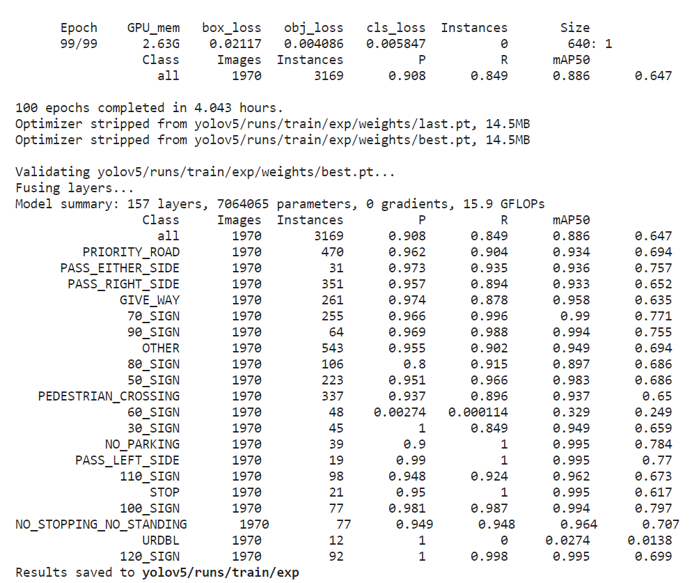
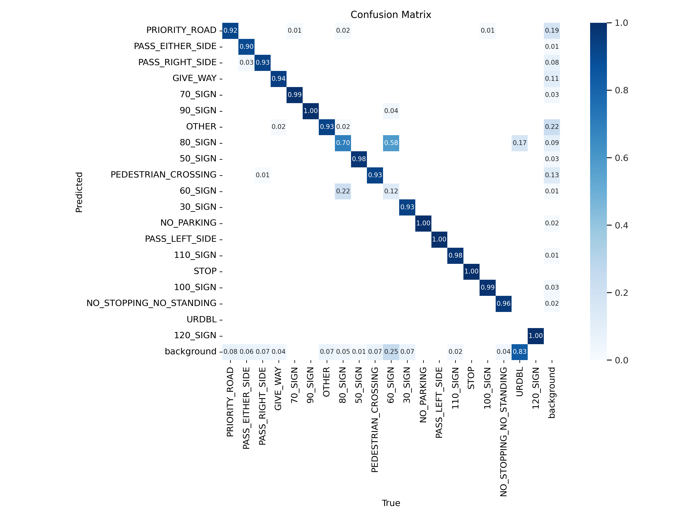
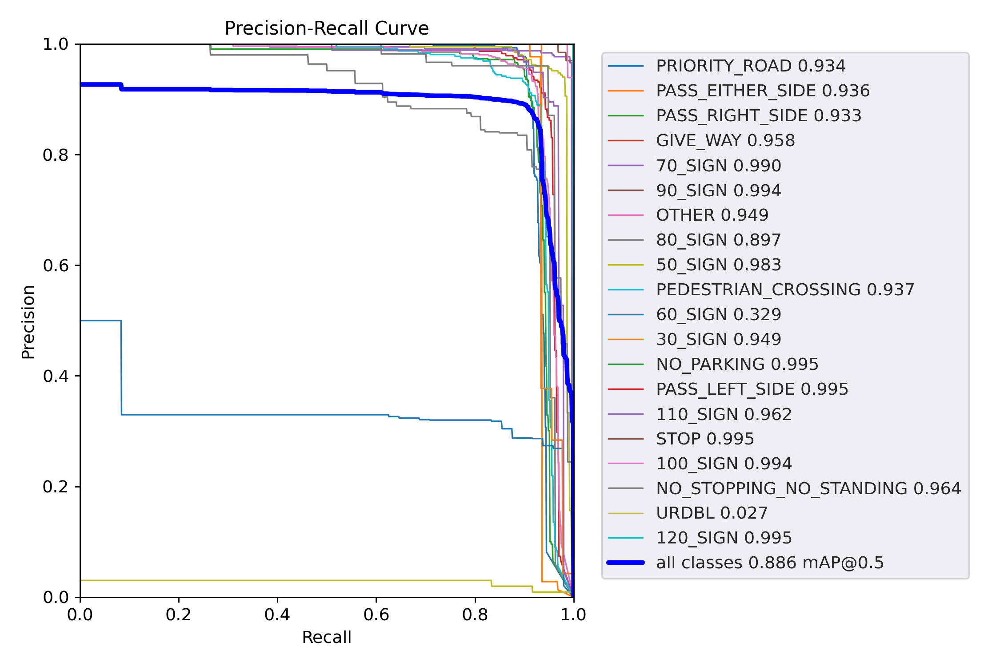
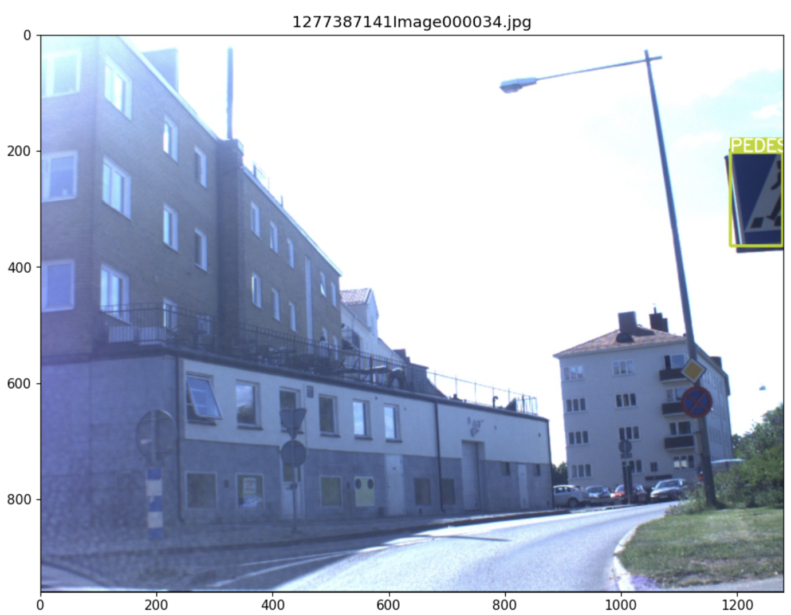
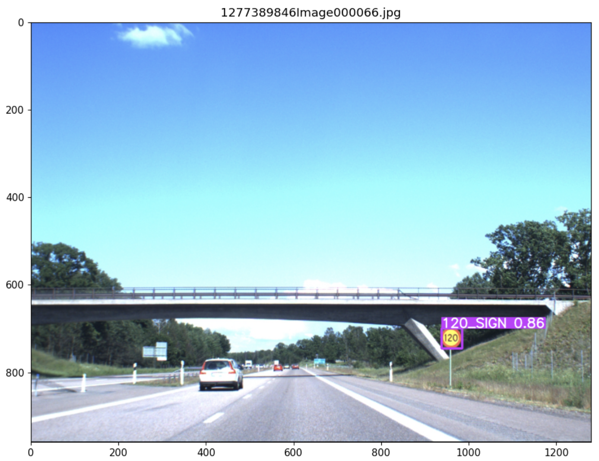
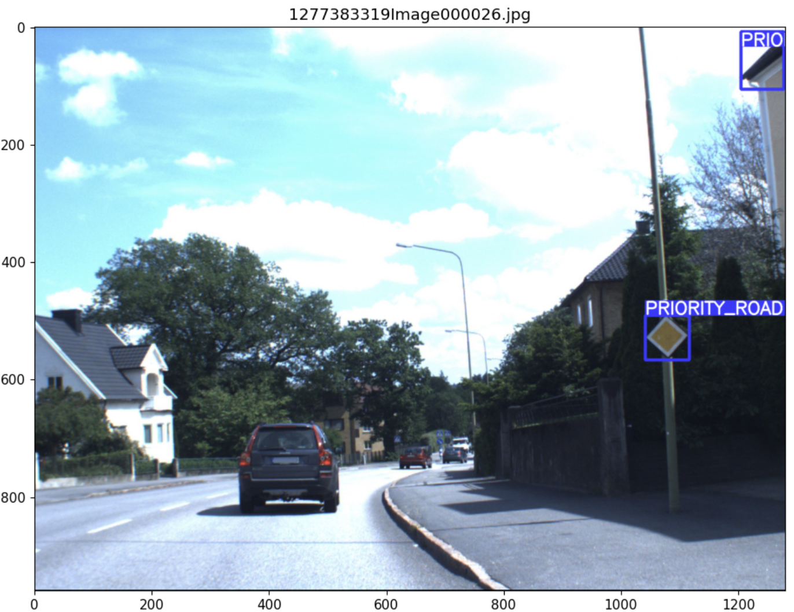
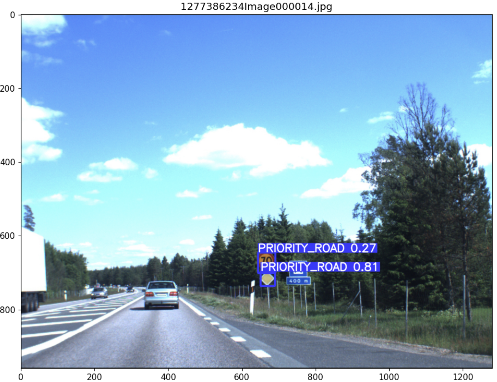
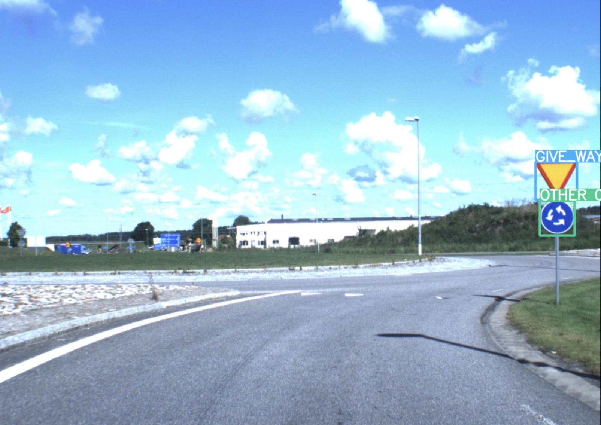
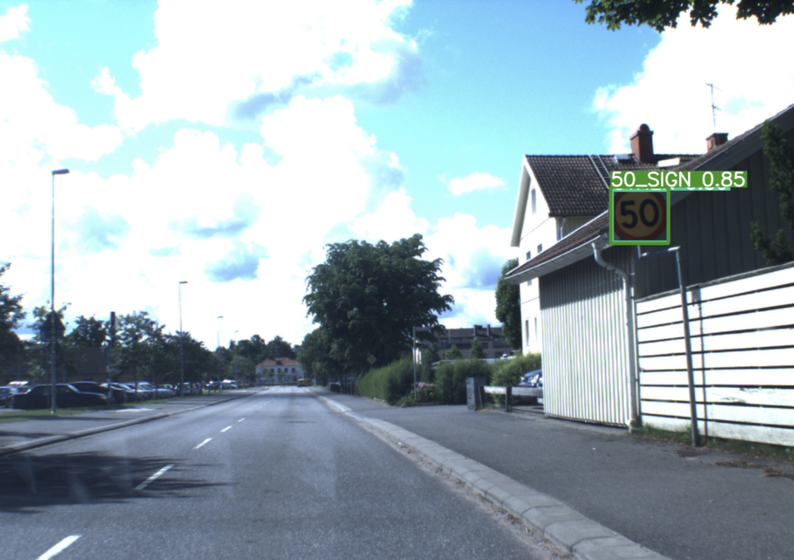
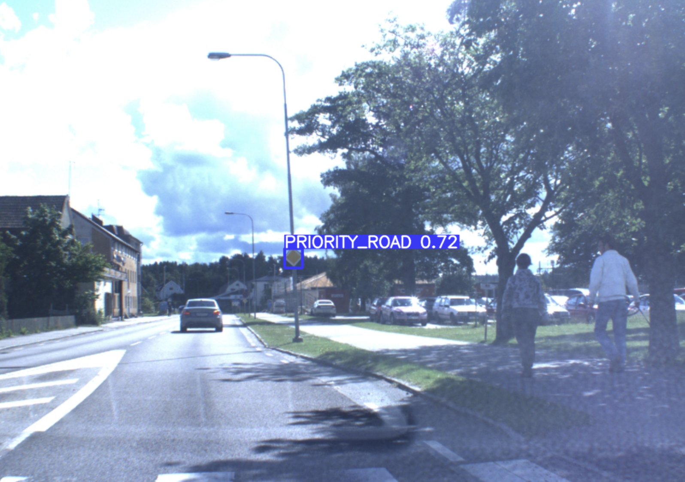

# Swedish Traffic Signs Detection using YOLOv5

This project focuses on detecting and classifying traffic signs in the [**Swedish Traffic Sign Dataset (STSD)**](https://www.cvl.isy.liu.se/en/research/datasets/traffic-signs-dataset/download/) using the [**YOLOv5**](https://github.com/ultralytics/yolov5) object detection model. This pipeline involves data processing, YOLO format conversion, model training, and inference.

## Dataset

The dataset used in this project consists of images of Swedish traffic signs along with corresponding annotations. Annotations are originally provided in a single .txt file, which includes the image names and their corresponding bounding box coordinates, sign type, sign status, sign size, sign centre, and sign aspect ratio.

## Setup

### 1. Clone the Repository

```bash
git clone https://github.com/HammadK44/traffic-sign-detection-CV-DNN.git
cd traffic-sign-detection-CV-DNN
```

Clone the YOLOv5 repository into the '*traffic-sign-detection-CV-DNN*' repo.

```bash
git clone https://github.com/ultralytics/yolov5
```

### 2. Install YOLOv5 Dependencies 
```bash
pip install -r yolov5/requirements.txt
```

### 3. Download and setup the STSD Dataset and Annotations (Set1Part0 for Training, Set2Part0 for Testing)

```bash
mkdir data/Set1Part0/images
wget -P data/Set1Part0/images http://www.isy.liu.se/cvl/research/trafficSigns/swedishSignsSummer/Set1/Set1Part0.zip
unzip data/Set1Part0/images/Set1Part0.zip
rm data/Set1Part0/images/Set1Part0.zip
mkdir data/Set1Part0/labels
wget -P data/Set1Part0/labels http://www.isy.liu.se/cvl/research/trafficSigns/swedishSignsSummer/Set1/annotations.txt
```
```bash
mkdir data/Set2Part0/images
wget -P data/Set2Part0/images http://www.isy.liu.se/cvl/research/trafficSigns/swedishSignsSummer/Set2/Set2Part0.zip
unzip data/Set2Part0/images/Set2Part0.zip
rm data/Set2Part0/images/Set2Part0.zip
mkdir data/Set2Part0/labels
wget -P data/Set2Part0/labels http://www.isy.liu.se/cvl/research/trafficSigns/swedishSignsSummer/Set2/annotations.txt
```

### 4. Copy STSD [VOC.yaml](https://github.com/HammadK44/traffic-sign-detection-CV-YOLOv5/blob/master/VOC.yaml) into YOLOv5 folder

```bash
cp ./VOC.yaml ./yolov5/VOC.yaml
```


## Running the Code

### 1. Data Processing

The data processing file ('*data_processing.py*') performs the following tasks:

- Reads the dataset annotations .txt file and converts into a csv file using the '*parse_txt_annotations.py*' script.
- Reads the annotation csv and filters out invalid bounding boxes ( [-1,-1,-1,-1] ).
- Creates YOLO format text files for training using the '*create_yolo_txts.py*' script.

Run the data processing file as follows:
```bash
python data_preprocessing.py
```

### 2. YOLOv5 Training

Running the YOLOv5 training script using the following command trains the model using the processed data. The training configuration is specified in '*VOC.yaml*'. This training was ran for a 100 epochs using the following command, without any modifications such as Data Augmentations, IoU threshold change, etc:

```bash
python ./yolov5/train.py --img 640 --batch 16 --epochs 100 --data ./yolov5/VOC.yaml --weights yolov5s.pt --workers 2
```

## 3. Inference

The inference script ('*inference.py*') uses the trained YOLOv5 model to make predictions on a set of random images. The results are displayed for visualization.

Run the inference script:

```bash
python inference.py --model_path "path-to-the-trained-model" --images_path "path-to-the-images"
```

## Results

Randomly selected images with model predictions are visualized using the *'inference.py'* output.

### 1. Train Dataset Evaluation Metrics

Following are the evaluation metrics using the training dataset, as well as the Confusion Matrix and Precision-Recall curves for all data classes:



| Class                    | Images | Instances |   P    |   R    | mAP50  |
|--------------------------|--------|-----------|-------|-------|--------|
| all                      | 1970   | 3169      | 0.908 | 0.849 | 0.886  | 0.647  |
| PRIORITY_ROAD            | 1970   | 470       | 0.962 | 0.904 | 0.934  | 0.694  |
| PASS_EITHER_SIDE         | 1970   | 31        | 0.973 | 0.935 | 0.936  | 0.757  |
| PASS_RIGHT_SIDE          | 1970   | 351       | 0.957 | 0.894 | 0.933  | 0.652  |
| GIVE_WAY                 | 1970   | 261       | 0.974 | 0.878 | 0.958  | 0.635  |
| 70_SIGN                  | 1970   | 255       | 0.966 | 0.996 | 0.99   | 0.771  |
| 90_SIGN                  | 1970   | 64        | 0.969 | 0.988 | 0.994  | 0.755  |
| OTHER                    | 1970   | 543       | 0.955 | 0.902 | 0.949  | 0.694  |
| 80_SIGN                  | 1970   | 106       | 0.8   | 0.915 | 0.897  | 0.686  |
| 50_SIGN                  | 1970   | 223       | 0.951 | 0.966 | 0.983  | 0.686  |
| PEDESTRIAN_CROSSING      | 1970   | 337       | 0.937 | 0.896 | 0.937  | 0.65   |
| 60_SIGN                  | 1970   | 48        | 0.00274 | 0.000114 | 0.329 | 0.249 |
| 30_SIGN                  | 1970   | 45        | 1     | 0.849 | 0.949  | 0.659  |
| NO_PARKING               | 1970   | 39        | 0.9   | 1     | 0.995  | 0.784  |
| PASS_LEFT_SIDE           | 1970   | 19        | 0.99  | 1     | 0.995  | 0.77   |
| 110_SIGN                 | 1970   | 98        | 0.948 | 0.924 | 0.962  | 0.673  |
| STOP                     | 1970   | 21        | 0.95  | 1     | 0.995  | 0.617  |
| 100_SIGN                 | 1970   | 77        | 0.981 | 0.987 | 0.994  | 0.797  |
| NO_STOPPING_NO_STANDING  | 1970   | 77        | 0.949 | 0.948 | 0.964  | 0.707  |
| URDBL                    | 1970   | 12        | 1     | 0     | 0.0274 | 0.0138 |
| 120_SIGN                 | 1970   | 92        | 1     | 0.998 | 0.995  | 0.699  |




### 2. Inference Results on Train Dataset







### 3. Test Dataset Evaluation Metrics

Following are the evaluation metrics using the testing dataset. As can be seen, the results on using the test dataset are not as good as when using the train dataset. This means that the model may be overfitting to the training data, and its performance on unseen data, represented by the test dataset, is not as robust. Several factors could contribute to this discrepancy, such as the diversity of the test set, differences in lighting conditions, or variations in traffic sign poses.


| Class                    | Images | Instances |   P    |   R    | mAP50  |
|--------------------------|--------|-----------|-------|-------|--------|
| all                      | 1807   | 3482      | 0.496 | 0.482 | 0.464  | 0.301  |
| PRIORITY_ROAD            | 1807   | 652       | 0.668 | 0.702 | 0.742  | 0.458  |
| PASS_EITHER_SIDE         | 1807   | 15        | 0.251 | 0.467 | 0.237  | 0.198  |
| PASS_RIGHT_SIDE          | 1807   | 500       | 0.562 | 0.658 | 0.683  | 0.459  |
| GIVE_WAY                 | 1807   | 121       | 0.555 | 0.76  | 0.773  | 0.457  |
| 70_SIGN                  | 1807   | 215       | 0.441 | 0.567 | 0.557  | 0.385  |
| OTHER                    | 1807   | 273       | 0.46  | 0.418 | 0.423  | 0.275  |
| 80_SIGN                  | 1807   | 193       | 0.338 | 0.316 | 0.351  | 0.241  |
| 50_SIGN                  | 1807   | 193       | 0.553 | 0.363 | 0.385  | 0.264  |
| PEDESTRIAN_CROSSING      | 1807   | 928       | 0.728 | 0.613 | 0.661  | 0.444  |
| 30_SIGN                  | 1807   | 9         | 0.214 | 0.333 | 0.164  | 0.0566 |
| NO_PARKING               | 1807   | 158       | 0.731 | 0.411 | 0.504  | 0.297  |
| STOP                     | 1807   | 57        | 0.665 | 0.351 | 0.413  | 0.257  |
| 100_SIGN                 | 1807   | 108       | 0.408 | 0.467 | 0.398  | 0.295  |
| NO_STOPPING_NO_STANDING  | 1807   | 60        | 0.371 | 0.315 | 0.207  | 0.134  |


## Training 2nd Run

In light of this, training was performed a second time, by first modifying the '*.yolov5/utils/augmentations.py*' file as follows:

```bash
new_augm_code = """

# existing code

class Albumentations:
    # YOLOv5 Albumentations class (optional, only used if package is installed)
    def __init__(self, size=640):
        self.transform = None
        prefix = colorstr('albumentations: ')
        try:
            import albumentations as A
            check_version(A.__version__, '1.0.3', hard=True)  # version requirement

            T = [
                A.RandomResizedCrop(height=size, width=size, scale=(0.8, 1.0), ratio=(0.9, 1.11), p=0.0),
                A.Blur(p=0.01),
                A.MedianBlur(p=0.01),
                A.ToGray(p=0.01),
                A.CLAHE(p=0.01),
                A.RandomBrightnessContrast(p=0.0),
                A.RandomGamma(p=0.0),
                A.ImageCompression(quality_lower=75, p=0.0)]  # transforms
                
            additional_transforms = [
                A.Rotate(limit=15, p=0.5),
                A.ShiftScaleRotate(shift_limit=0.1, scale_limit=0.1, rotate_limit=15, p=0.5),
                A.IAAPerspective(p=0.5),
                A.HueSaturationValue(hue_shift_limit=10, sat_shift_limit=20, val_shift_limit=10, p=0.5),
                A.ColorJitter(brightness=0.1, contrast=0.1, saturation=0.1, hue=0.1, p=0.5),
                A.GaussianBlur(blur_limit=(3, 7), p=0.1),
                A.IAAPerlinNoise(p=0.1),
                A.RandomErasing(p=0.3),
                A.Cutout(num_holes=1, max_h_size=8, max_w_size=8, p=0.3),
                A.LensDistortion(distort_limit=0.2, shift_limit=0.2, p=0.3),
                A.IAAFisheye(p=0.1)]                                             # additional transforms added

            self.transform = A.Compose(T + additional_transforms, bbox_params=A.BboxParams(format='yolo', label_fields=['class_labels']))

        # existing code

        """

with open("/kaggle/working/yolov5/utils/augmentations.py", "w") as file:
    file.write(new_augm_code)
```

Then trained with 1280x1280 images shape and for 60 epochs, instead of 640x640 as previously done with 100 epochs:

```bash
python ./yolov5/train.py --img 1280 --batch 16 --epochs 60 --data ./yolov5/VOC.yaml --weights yolov5s.pt --workers 2
```

## 1. Test Dataset Evaluation Metrics with Second Model

As can be seen the results, the second training run, with modifications to the augmentations and an increased image size of 1280x1280 resulted in significant improvements in performance metrics compared to the initial training. The evaluation metrics on the test dataset demonstrate enhanced precision, recall, and mAP50 values across various classes. The overall performance, as indicated by the 'all' category, shows a substantial increase in precision (P), recall (R), and mean Average Precision at IoU 0.5 (mAP50). This suggests that the adjustments made to the training process have successfully addressed overfitting and improved the model's generalization to unseen data.


| Class                    | Images | Instances |   P    |   R    | mAP50  |
|--------------------------|--------|-----------|-------|-------|--------|
| all                      | 1807   | 3482      | 0.714 | 0.55  | 0.608  | 0.401  |
| PRIORITY_ROAD            | 1807   | 652       | 0.922 | 0.811 | 0.855  | 0.555  |
| PASS_EITHER_SIDE         | 1807   | 15        | 0.592 | 0.6   | 0.503  | 0.421  |
| PASS_RIGHT_SIDE          | 1807   | 500       | 0.882 | 0.71  | 0.781  | 0.549  |
| GIVE_WAY                 | 1807   | 121       | 0.908 | 0.769 | 0.797  | 0.523  |
| 70_SIGN                  | 1807   | 215       | 0.79  | 0.631 | 0.718  | 0.509  |
| OTHER                    | 1807   | 273       | 0.662 | 0.491 | 0.543  | 0.345  |
| 80_SIGN                  | 1807   | 193       | 0.585 | 0.301 | 0.446  | 0.298  |
| 50_SIGN                  | 1807   | 193       | 0.695 | 0.437 | 0.588  | 0.405  |
| PEDESTRIAN_CROSSING      | 1807   | 928       | 0.946 | 0.706 | 0.788  | 0.524  |
| 30_SIGN                  | 1807   | 9         | 0.114 | 0.111 | 0.0606 | 0.0219 |
| NO_PARKING               | 1807   | 158       | 0.804 | 0.671 | 0.745  | 0.43   |
| STOP                     | 1807   | 57        | 0.83  | 0.526 | 0.622  | 0.318  |
| 100_SIGN                 | 1807   | 108       | 0.628 | 0.546 | 0.641  | 0.435  |
| NO_STOPPING_NO_STANDING  | 1807   | 60        | 0.641 | 0.388 | 0.42   | 0.281  |


## 2. Test Dataset Inference Results with Second Model





## Trained Model

The trained model can be used directly for inference. Model file can be found in the specified *model_path*, and the following script can be used to run the inference. 

```bash
import torch
from matplotlib import pyplot as plt
import numpy as np
import cv2
import random
import os 

model_path = './trained_model/best_final.pt'
model = torch.hub.load('ultralytics/yolov5', 'custom', path=model_path, force_reload=True)

imgs = os.listdir('./data/Set1Part0/images')
random_images = random.sample(imgs, 5)

fig, axs = plt.subplots(15, 1, figsize=(20, 10 * 15))

for i, imgname in enumerate(random_images):
    img = cv2.imread(f'/kaggle/working/data/images/{imgname}')
    results = model(img)
    axs[i].imshow(cv2.cvtColor(np.squeeze(results.render()), cv2.COLOR_BGR2RGB))
    axs[i].set_title(imgname)
    
plt.show()
```

## License

This project is licensed under the MIT License
